# UltimateTrader — Trading Decision-Flow (Source of Truth)

> **Purpose.** A faithful, line-anchored decision graph of the **LIVE production path** of the
> UltimateTrader MQL5 XAUUSD EA, on the **default configuration** as shipped in
> `UltimateTrader_Inputs.mqh`. This file is the single source of truth for a reviewable flowchart.
> It is **static / source-only** (no backtest results, no opinions). Two co-equal representations
> of the SAME graph are provided: (1) a Mermaid `flowchart TD`, and (2) a node/edge table with a
> real `file:line` anchor on every node so an AI agent can reconstruct the graph deterministically.
>
> **Symbol/account assumptions** (stated, not silent): symbol `XAUUSD+`, primary decision TF
> **H1** (new-bar gate is `iTime(_Symbol, PERIOD_H1, 0)`), one entry decision per closed H1 bar;
> hedging vs netting is not branched on in this path. All anchors verified against source on the
> repo state at authoring; where the live repo diverged from prior docs it is noted in §Caveats.
>
> **Repo paths referenced** (all absolute):
> - `/mnt/c/Trading/UltimateTrader/UltimateTrader.mq5` (main EA: `OnTick`)
> - `/mnt/c/Trading/UltimateTrader/UltimateTrader_Inputs.mqh` (inputs + defaults)
> - `/mnt/c/Trading/UltimateTrader/Include/Core/CSignalOrchestrator.mqh`
> - `/mnt/c/Trading/UltimateTrader/Include/Core/CTradeOrchestrator.mqh`
> - `/mnt/c/Trading/UltimateTrader/Include/Core/CRiskMonitor.mqh`
> - `/mnt/c/Trading/UltimateTrader/Include/Core/CPositionCoordinator.mqh`
> - `/mnt/c/Trading/UltimateTrader/Include/Validation/CSignalValidator.mqh`
> - `/mnt/c/Trading/UltimateTrader/Include/EntryPlugins/CFileEntry.mqh`
> - `/mnt/c/Trading/UltimateTrader/Include/Execution/CEnhancedTradeExecutor.mqh`

---

## Legend (node types)

| Type | Mermaid shape | Meaning |
|------|---------------|---------|
| `decision` | `{ }` rhombus | A branch point (true/false). |
| `gate` | `[ ]` rectangle | A pass/reject filter; on reject it routes to a terminal. |
| `action` | `[ ]` rectangle | A state mutation (compute, scale risk, send order, register). |
| `risk-mult` | `[/ /]` parallelogram | A risk-sizing multiplier in the conditioning chain (does NOT reject; only scales `signal.riskPercent`). |
| `terminal` | `([ ])` stadium | An end state: NO_TRADE / SKIP / BLOCK / DEFER / EXECUTED / position-closed. |

Node IDs are short (`N1`, `N2`, …). Terminal IDs are prefixed `T*`. The two representations use
the SAME IDs.

---

## Mermaid flowchart (representation 1)

```mermaid
flowchart TD
    %% ============ ENTRY: OnTick ============
    N1{InpEmergencyDisable?}
    N1 -- yes --> T_KILL([T_KILL: NO_TRADE_EMERGENCY_DISABLE])
    N1 -- no --> N2{New H1 bar?<br/>iTime PERIOD_H1,0 != g_lastBarTime}
    N2 -- no --> M0
    N2 -- yes --> N3[Reset g_session_quality_factor=1.0<br/>UpdateMarketState: trend/regime/macro/SMC/ATR/ADX]
    N3 --> N4{InpEnableMultiStrategy?<br/>DORMANT default=false}
    N4 -- yes --> N4a[regimeRouter.UpdateActivation<br/>set per-engine weights]
    N4 -- no --> N5
    N4a --> N5{InpEnableBreakoutProbation<br/>&& probation.active?<br/>DORMANT default=false}
    N5 -- yes --> N5a{H1 close held outside level?}
    N5a -- held 2 bars --> N5b[Execute stored breakout signal<br/>via gate-lite path]
    N5a -- failed --> T_PROB([T_PROB: probation cancelled])
    N5 -- no --> N6[Classify day-type<br/>dayRouter.ClassifyDay -> engines]
    N5b --> N6
    N6 --> N7{Friday?<br/>day_of_week==5}
    N7 -- yes --> T_FRI([T_FRI: NO_TRADE_FRIDAY_BLOCK])
    N7 -- no --> N8

    %% ============ CONFIRMATION-PENDING PIPELINE ============
    N8{InpEnableConfirmation<br/>&& HasPendingSignal?}
    N8 -- no --> N20
    N8 -- yes --> N9[IncrementPendingBarCount]
    N9 --> N10{CheckPendingConfirmation?<br/>confirm candle closes thru pattern}
    N10 -- no --> N11{pending_bar_count >=<br/>InpConfirmationWindowBars=1?}
    N11 -- yes --> T_CONFEXP([T_CONFEXP: pending expired, cleared])
    N11 -- no --> N20
    N10 -- yes --> N12{Soft or Full RevalidatePending?<br/>InpSoftRevalidation=false -> full}
    N12 -- reject --> T_REVAL([T_REVAL: revalidation failed, cleared])
    N12 -- ok --> N13{ShouldBlockLongExtensionCore?<br/>72h rise>=InpLongExtensionPct<br/>AND weekly EMA20 falling}
    N13 -- block --> T_EXT1([T_EXT1: NO_TRADE_LONG_EXTENSION confirmed])
    N13 -- pass --> N14{PassConfirmedEntryQualityFilter?<br/>DORMANT default=false -> pass}
    N14 -- reject --> T_CQF([T_CQF: weak confirmed long, cleared])
    N14 -- pass --> N15[/regime_risk_multiplier:<br/>chop .6 / volatile .7 / ranging .75 / else 1.0/]
    N15 --> N16[ProcessConfirmedSignal -> ExecuteSignal chain]
    N16 --> GATEXEC

    %% ============ NEW-SIGNAL GENERATION (immediate path) ============
    N20{NOT halted && CanTrade?<br/>CRiskMonitor}
    N20 -- no --> T_HALT([T_HALT: NO_TRADE_HALTED / MAX_DAILY])
    N20 -- yes --> N21{InpEnableShockDetection?<br/>default=true}
    N21 -- extreme shock --> T_SHOCK([T_SHOCK: NO_TRADE_SHOCK_EXTREME])
    N21 -- moderate shock --> N22[/shock_factor = 1 - intensity*0.5/]
    N21 -- none / off --> N22b[shock_factor=1.0]
    N22 --> N23
    N22b --> N23
    N23{InpEnableSessionQualityGate?<br/>default=true}
    N23 -- quality below block 0.25 --> T_SQ([T_SQ: NO_TRADE_SESSION_QUALITY])
    N23 -- quality below reduce 0.50 --> N24[/sq_factor = session_quality/]
    N23 -- ok / off --> N24b[sq_factor=1.0]
    N24 --> N25
    N24b --> N25
    N25{Spread gate ok?<br/>executor.CheckSpreadGate<br/>InpMaxSpreadPoints=50}
    N25 -- too wide --> T_SPREAD([T_SPREAD: NO_TRADE_SPREAD_HIGH])
    N25 -- ok --> N26{InpEnableThrashCooldown<br/>&& IsRegimeThrashing?<br/>default=true}
    N26 -- thrashing --> T_THRASH([T_THRASH: NO_TRADE_REGIME_THRASH])
    N26 -- ok --> N27[CheckForNewSignals: per-plugin -> validate -> rank]

    %% ----- CheckForNewSignals internals -----
    N27 --> O1{IsSessionAllowed?<br/>Asia/London/NY toggles + bear-regime bypass}
    O1 -- no --> T_SESS([T_SESS: NO_TRADE_SESSION_BLOCKED])
    O1 -- yes --> O2{In skip-hour zone?<br/>InpSkipStartHour..End GMT}
    O2 -- yes, non-Session plugin --> O2skip[skip those plugins this bar]
    O2 -- no --> O3
    O2skip --> O3[Loop enabled entry plugins -> EntrySignal]
    O3 --> O4{signal.valid?}
    O4 -- no --> O3
    O4 -- yes --> O5{SHORT or LONG?}
    O5 -- SHORT --> O6{is_engine && HTF uptrend?<br/>routed-engine only}
    O6 -- yes --> T_VETO([T_VETO: HTF_UPTREND_SHORT_VETO])
    O6 -- no --> O7{ATR >= tf_min_atr?}
    O7 -- no --> T_ATR([T_ATR: NO_TRADE_ATR_BELOW_MIN short])
    O7 -- yes --> O10
    O5 -- LONG --> O8{MR or trend pattern?}
    O8 -- MR --> O8a[ValidateMeanReversionConditions<br/>ADX/ATR band]
    O8 -- trend --> O8b[ValidateTrendFollowingConditions<br/>-> ValidateEntryConditions 200EMA/regime ladder]
    O8a --> O9{validated?}
    O8b --> O9
    O9 -- no --> T_VAL([T_VAL: NO_TRADE_VALIDATOR_REJECT])
    O9 -- yes --> O10[ValidateVolumeSpread breakouts]
    O10 --> O10g{volume ok?}
    O10g -- no --> T_VOL([T_VOL: NO_TRADE_VOLUME_FILTER])
    O10g -- yes --> O11{ValidateSMCConditions<br/>counter-OB block / confluence>=40?}
    O11 -- no --> T_SMC([T_SMC: NO_TRADE_SMC_FILTER])
    O11 -- yes --> O12{confidence >= min?}
    O12 -- no --> T_CONF([T_CONF: NO_TRADE_LOW_CONFIDENCE])
    O12 -- yes --> O13{quality tier == SETUP_NONE?}
    O13 -- yes --> T_QUAL([T_QUAL: NO_TRADE_QUALITY_BELOW_MIN])
    O13 -- no --> O14[/GetRiskForQuality -> riskPercent; rank by qualityScore/]
    O14 --> O3
    O3 -- loop done --> O15{any candidate?}
    O15 -- no --> T_NOCAND([T_NOCAND: NO_SIGNAL this bar])
    O15 -- yes --> O16{winner needs confirmation?<br/>requiresConfirmation && not MR && not SHORT}
    O16 -- yes --> O17[StorePendingSignal -> return empty]
    O17 --> T_DEFER([T_DEFER: probation-defer to next bar])
    O16 -- no --> N30[return best_signal IMMEDIATE]

    %% ============ IMMEDIATE PERMISSION + RISK CONDITIONING ============
    N30 --> N31{ShouldBlockLongExtension?<br/>72h rise>=InpLongExtensionPct & weekly falling}
    N31 -- block --> T_EXT2([T_EXT2: NO_TRADE_LONG_EXTENSION immediate])
    N31 -- pass --> N32{GetPositionCount < InpMaxPositions=5?}
    N32 -- no --> T_MAXPOS([T_MAXPOS: NO_TRADE_MAX_POSITIONS])
    N32 -- yes --> N33[/Session risk mult: London .50 / NY .90 / Asia 1.0<br/>InpEnableSessionRiskAdjust=true/]
    N33 --> N34[/Wednesday mult x0.85<br/>InpEnableWednesdayReduction DORMANT=false/]
    N34 --> N35[/Combined shock*sq factor, floored InpMinSessionRiskFactor=0.25/]
    N35 --> N36{SL distance < InpMinSLToSpreadRatio=3 x spread?}
    N36 -- yes --> T_SLSPREAD([T_SLSPREAD: NO_TRADE_SL_TOO_TIGHT])
    N36 -- no --> N37[/RegimeRiskScaler.ApplyToRisk<br/>trending1.25/volatile.75/choppy.60/]
    N37 --> N38[/QualityTrendBoost in TRENDING<br/>DORMANT=false/]
    N38 --> N39[/ATR-velocity boost x1.15 if accel>15%<br/>InpEnableATRVelocity=true/]
    N39 --> N40{InpEnableBreakoutProbation<br/>&& breakout pattern?<br/>DORMANT=false}
    N40 -- yes --> N40a[divert to 2-bar probation]
    N40a --> T_DEFER2([T_DEFER2: probation-defer breakout])
    N40 -- no --> GATEXEC

    %% ============ EXECUTESIGNAL GATE CHAIN (shared by immediate + confirmed + file + probation) ============
    GATEXEC[ExecuteSignal: build trade] --> X1{File slippage > InpFileMaxSlippagePct?<br/>file signals only}
    X1 -- yes --> T_SLIP([T_SLIP: NO_TRADE_FILE_SLIPPAGE])
    X1 -- no --> X2{risk_distance <= 0?}
    X2 -- yes --> T_RISKDIST([T_RISKDIST: NO_TRADE_INVALID_RISK_DIST])
    X2 -- no --> X3{actual RR < min?<br/>InpMinRRRatio=1.3; file bypasses}
    X3 -- yes --> T_RR([T_RR: NO_TRADE_RR_BELOW_MIN])
    X3 -- no --> X4{InpEnableRewardRoom<br/>&& room < InpMinRoomToObstacle?<br/>DORMANT=false}
    X4 -- yes --> T_ROOM([T_ROOM: NO_TRADE_INSUFFICIENT_ROOM would-be])
    X4 -- no --> X5[/EC v3 risk multiplier<br/>g_ecController, <=1.0/]
    X5 --> X6[/Short protection x InpShortRiskMultiplier=1.0 OFF/]
    X6 --> X7[/Hard cap risk at InpMaxRiskPerTrade=2.0/]
    X7 --> X8[risk strategy -> lot_size]
    X8 --> X9{lot_size <= 0?}
    X9 -- yes --> T_LOT([T_LOT: NO_TRADE_INVALID_LOT])
    X9 -- no --> X10[/Counter-trend 200EMA halving x0.5 non-file/]
    X10 --> X11{Exposure cap: open_risk+risk > InpMaxTotalExposure=5.0?}
    X11 -- no headroom --> T_EXPO([T_EXPO: NO_TRADE_EXPOSURE_CAP])
    X11 -- partial --> X11a[/rescale lot to headroom/]
    X11 -- ok --> X12
    X11a --> X12[executor.ExecuteTradeWithRetries<br/>spread+slippage re-check inside]
    X12 --> X13{exec success && ticket>0?}
    X13 -- no --> T_EXEC([T_EXEC: NO_TRADE_EXECUTION_FAILED])
    X13 -- yes --> N50[Build SPosition + stamp regime-exit profile]
    N50 --> N51[AddPosition; IncrementTradesToday; LogTradeEntry]
    N51 --> T_EXECUTED([T_EXECUTED: POSITION OPEN])

    %% ============ FILE / CSV PER-TICK PATH (bypasses orchestrator gates) ============
    M0[every-tick block]
    M0 --> F1[Adopt untracked broker positions with our magic]
    F1 --> F2{InpSignalSource in BOTH/FILE<br/>&& count<MaxPositions<br/>&& not halted && CanTrade?}
    F2 -- no --> M1
    F2 -- yes --> F3[g_fileEntry.CheckForEntrySignal]
    F3 --> F4{trade ready?<br/>not executed, in time window}
    F4 -- no --> M1
    F4 -- yes --> F5{price sanity ok?<br/>0.3x..3x bid; mode SL/TP valid}
    F5 -- no --> T_FILEREJ([T_FILEREJ: file signal rejected/parse])
    F5 -- yes --> F6[set lot mode risk/fixed/csv -> ExecuteSignal chain]
    F6 --> GATEXEC2[ExecuteSignal chain X1..X13]
    GATEXEC2 -- ticket gt 0 --> F7[AddPosition; ConfirmExecuted durable]
    GATEXEC2 -- ticket le 0 --> F8[RollbackPending retry next in-window tick]
    F7 --> M1
    F8 --> M1

    %% ============ EVERY-TICK MANAGEMENT + RISK MONITOR ============
    M1[ManageOpenPositions per tick] --> P1{any open position?}
    P1 -- no --> M2
    P1 -- yes --> P2[Per position: update MAE/MFE]
    P2 --> P3[TP0/TP1/TP2 partial closes by trigger]
    P3 --> P4[Breakeven move when BE trigger hit]
    P4 --> P5[Trailing stop update<br/>InpTrailingStrategy]
    P5 --> P6[Exit-plugin checks g_exitPlugins.CheckForExit]
    P6 --> P7{SL/exit/all-TP closed?}
    P7 -- yes --> T_CLOSED([T_CLOSED: position closed, removed])
    P7 -- no --> M2
    M2[CheckRiskLimits per tick] --> M3{daily PnL <= -InpDailyLossLimit=3%?}
    M3 -- yes --> T_DAYHALT([T_DAYHALT: HALT_DAILY_LOSS sets halt flag])
    M3 -- no --> M4([M4: TICK_END tick complete])
    T_CLOSED --> M2
```

---

## Node / edge spec (representation 2)

One row per node. `true→` / `false→` give the next node ID on each branch (terminals have none).
`file:line` is the deciding code. Defaults are quoted from `UltimateTrader_Inputs.mqh`.

### Phase A — New-bar detection & context

| id | label | type | condition | true→ | false→ | file:line |
|----|-------|------|-----------|-------|--------|-----------|
| N1 | Emergency kill switch | decision | `InpEmergencyDisable` (default false) | T_KILL | N2 | UltimateTrader.mq5:1437 |
| N2 | New H1 bar? | decision | `iTime(_Symbol,PERIOD_H1,0) != g_lastBarTime` | N3 | M0 | UltimateTrader.mq5:1449-1454 |
| N3 | Reset risk factor + update market state | action | `g_session_quality_factor=1.0; g_stateManager.UpdateMarketState()` (trend/regime/macro/SMC/ATR/ADX) | N4 | — | UltimateTrader.mq5:1462-1465 |
| N4 | Multi-strategy router? | decision | `InpEnableMultiStrategy && g_regimeRouter!=NULL` (DORMANT, default false) | N4a | N5 | UltimateTrader.mq5:1474 |
| N4a | Set per-engine activation weights | action | `g_regimeRouter.UpdateActivation()` | N5 | — | UltimateTrader.mq5:1475 |
| N5 | Breakout-probation active? | decision | `InpEnableBreakoutProbation && g_breakoutProbation.active` (DORMANT, default false) | N5a | N6 | UltimateTrader.mq5:1478 |
| N5a | Did H1 close hold outside level? | decision | held vs `g_breakoutProbation.level` | N5b | T_PROB | UltimateTrader.mq5:1481-1485 |
| N5b | Execute stored breakout (gate-lite) | action | `count<InpMaxPositions && !IsTradingHalted && CanTrade` → `ExecuteSignal` | N6 | T_PROB | UltimateTrader.mq5:1501-1554 |
| N6 | Classify day-type | action | `g_dayRouter.ClassifyDay()` → engines.SetDayType | N7 | — | UltimateTrader.mq5:1574-1580 |
| N7 | Friday block | decision | `dow.day_of_week==5` (Sprint 3D) | T_FRI | N8 | UltimateTrader.mq5:1585-1587 |

### Phase B — Confirmation-pending pipeline

| id | label | type | condition | true→ | false→ | file:line |
|----|-------|------|-----------|-------|--------|-----------|
| N8 | Pending signal present? | decision | `InpEnableConfirmation (true) && g_signalOrchestrator.HasPendingSignal()` | N9 | N20 | UltimateTrader.mq5:1590 |
| N9 | Increment pending bar count | action | `IncrementPendingBarCount()` | N10 | — | UltimateTrader.mq5:1593 |
| N10 | Confirmation candle met? | decision | `CheckPendingConfirmation()` (close beyond pattern_high/low ± strictness) | N12 | N11 | UltimateTrader.mq5:1595 / CSignalOrchestrator.mqh:896-932 |
| N11 | Confirmation window exhausted? | decision | `pending_bar_count >= InpConfirmationWindowBars` (default 1) | T_CONFEXP | N20 | UltimateTrader.mq5:1727 |
| N12 | Revalidate pending | gate | full `RevalidatePending()` (InpSoftRevalidation=false) | N13 | T_REVAL | UltimateTrader.mq5:1598-1601 |
| N13 | Long-extension gate (confirmed) | gate | `ShouldBlockLongExtensionCore`: 72h rise ≥ `InpLongExtensionPct` (0.5) AND weekly EMA20 falling | T_EXT1 | N14 | UltimateTrader.mq5:1608 / UltimateTrader.mq5:402-460 |
| N14 | Confirmed-entry quality filter | gate | `PassConfirmedEntryQualityFilter` (DORMANT: `InpEnableConfirmedQualityFilter`=false → pass) | N15 | T_CQF | UltimateTrader.mq5:1626 / 1357-1360 |
| N15 | Confirmed regime risk mult | risk-mult | chop 0.6 / volatile 0.7 / ranging 0.75 / else 1.0 | N16 | — | UltimateTrader.mq5:1638-1648 |
| N16 | Process confirmed → ExecuteSignal | action | `ProcessConfirmedSignal(pending)` builds exec_signal then runs ExecuteSignal chain | GATEXEC | — | UltimateTrader.mq5:1655 / CTradeOrchestrator.mqh:795-958 |

### Phase C — Pre-gates (immediate path)

| id | label | type | condition | true→ | false→ | file:line |
|----|-------|------|-----------|-------|--------|-----------|
| N20 | Permission: not halted & CanTrade | gate | `!IsTradingHalted() && CanTrade()` | N21 | T_HALT | UltimateTrader.mq5:1744 / CRiskMonitor.mqh:116,132 |
| N21 | Shock detection | decision | `InpEnableShockDetection` (true); DetectShock | T_SHOCK (extreme) / N22 (moderate) | N22b | UltimateTrader.mq5:1756-1776 |
| N22 | Moderate-shock risk reducer | risk-mult | `shock_factor = 1 - intensity*0.5` ∈ [0.5,1] | N23 | — | UltimateTrader.mq5:1771-1772 |
| N22b | No shock | action | `shock_factor = 1.0` | N23 | — | UltimateTrader.mq5:1751 |
| N23 | Session execution-quality gate | decision | `InpEnableSessionQualityGate` (true); quality < block 0.25 / < reduce 0.50 | T_SQ (block) / N24 (reduce) | N24b | UltimateTrader.mq5:1779-1795 |
| N24 | Session-quality risk reducer | risk-mult | `sq_factor = session_quality` | N25 | — | UltimateTrader.mq5:1792 |
| N24b | Good session | action | `sq_factor = 1.0` | N25 | — | UltimateTrader.mq5:1752 |
| N25 | Spread gate | gate | `g_tradeExecutor.CheckSpreadGate()` vs `InpMaxSpreadPoints`=50 | N26 | T_SPREAD | UltimateTrader.mq5:1806 |
| N26 | Regime thrash cooldown | gate | `InpEnableThrashCooldown (true) && IsRegimeThrashing()` (>2 regime changes/4h) | T_THRASH | N27 | UltimateTrader.mq5:1811 |
| N27 | Generate & rank signals | action | `CheckForNewSignals()` (enters O1) | O1 | — | UltimateTrader.mq5:1819 / CSignalOrchestrator.mqh:434 |

### Phase D — CheckForNewSignals (per-plugin validate → rank → confirm)

| id | label | type | condition | true→ | false→ | file:line |
|----|-------|------|-----------|-------|--------|-----------|
| O1 | Session allowed? | gate | `IsSessionAllowed(asia/london/ny)` (all true) unless bear-regime bypass | O2 | T_SESS | CSignalOrchestrator.mqh:465-472 |
| O2 | In skip-hour zone? | decision | `!IsTradingHourAllowed(InpSkipStartHour..End)` (default 11..11 = disabled) | O2skip | O3 | CSignalOrchestrator.mqh:474-480 |
| O2skip | Skip non-Session plugins | action | non-`SessionEngine` plugins skipped this bar | O3 | — | CSignalOrchestrator.mqh:533-541 |
| O3 | Loop enabled entry plugins | action | per plugin `CheckForEntrySignal()` (auto-kill skip) | O4 | O15 (loop done) | CSignalOrchestrator.mqh:517-544 |
| O4 | Plugin signal valid? | decision | `signal.valid` | O5 | O3 | CSignalOrchestrator.mqh:546 |
| O5 | Direction? | decision | action BUY→LONG / SELL→SHORT | O6 (short) / O8 (long) | O3 (none) | CSignalOrchestrator.mqh:583-589 |
| O6 | HTF-uptrend short veto | gate | `is_engine (routed-only) && (H4|D1 bullish) && price>MA200` | T_VETO | O7 | CSignalOrchestrator.mqh:645-654 |
| O7 | Short ATR floor | gate | `current_atr >= m_tf_min_atr` | O10 | T_ATR | CSignalOrchestrator.mqh:656-663 |
| O8 | MR or trend pattern? | decision | `IsMeanReversionPattern(pat_type)` | O8a | O8b | CSignalOrchestrator.mqh:618,668 |
| O8a | Validate mean-reversion | gate | ADX<max, ATR within [min,max] band | O9 | T_VAL | CSignalValidator.mqh:224-262 |
| O8b | Validate trend-following | gate | bear-regime/ATR floor → `ValidateEntryConditions` (200EMA + trend-align + per-regime ladder) | O9 | T_VAL | CSignalValidator.mqh:269-326 / 331-673 |
| O9 | Validated? | decision | result of O8a/O8b | O10 | T_VAL | CSignalOrchestrator.mqh:682 |
| O10 | Volume/spread (breakouts) | action | `ValidateVolumeSpread(pat_type)` (non-breakouts auto-pass) | O10g | — | CSignalOrchestrator.mqh:695 / CSignalValidator.mqh:122-157 |
| O10g | Volume ok? | decision | volume ratio ≥ `min_volume_ratio` | O11 | T_VOL | CSignalValidator.mqh:149-157 |
| O11 | SMC confluence | gate | not in counter-OB (if block_counter) AND confluence ≥ 40 | O12 | T_SMC | CSignalOrchestrator.mqh:706 / CSignalValidator.mqh:163-202 |
| O12 | Pattern confidence | gate | `confidence >= m_min_pattern_confidence` (when scoring enabled) | O13 | T_CONF | CSignalOrchestrator.mqh:717-733 |
| O13 | Quality tier below min? | decision | `quality == SETUP_NONE` | T_QUAL | O14 | CSignalOrchestrator.mqh:750 |
| O14 | Score & rank | action | `GetRiskForQuality`→riskPercent; keep best by `qualityScore` | O3 | — | CSignalOrchestrator.mqh:773-850 |
| O15 | Any candidate passed? | decision | `candidate_count>0 && best_signal.valid` | O16 | T_NOCAND | CSignalOrchestrator.mqh:854 |
| O16 | Winner needs confirmation? | decision | `requiresConfirmation && !MR && sig!=SHORT` | O17 | N30 | CSignalOrchestrator.mqh:878-880 |
| O17 | Store pending | action | `StorePendingSignal(...)` → return empty | T_DEFER | — | CSignalOrchestrator.mqh:882-885 |

### Phase E — Immediate permission + risk-conditioning chain

| id | label | type | condition | true→ | false→ | file:line |
|----|-------|------|-----------|-------|--------|-----------|
| N30 | Return best (immediate) | action | `return best_signal` | N31 | — | CSignalOrchestrator.mqh:889-890 |
| N31 | Long-extension gate (immediate) | gate | `ShouldBlockLongExtension`: 72h rise ≥ `InpLongExtensionPct`(0.5) AND weekly EMA20 falling | T_EXT2 | N32 | UltimateTrader.mq5:1826 / 462-472 |
| N32 | Max positions | gate | `GetPositionCount() < InpMaxPositions` (5) | N33 | T_MAXPOS | UltimateTrader.mq5:1846 |
| N33 | Session risk multiplier | risk-mult | London ×`InpLondonRiskMultiplier`(0.50) / NY ×0.90 / Asia 1.0 (`InpEnableSessionRiskAdjust`=true) | N34 | — | UltimateTrader.mq5:1858-1888 |
| N34 | Wednesday risk multiplier | risk-mult | ×`InpWednesdayRiskMult`(0.85) (DORMANT: `InpEnableWednesdayReduction`=false) | N35 | — | UltimateTrader.mq5:1892-1904 |
| N35 | Combined shock×sq factor | risk-mult | `shock_factor*sq_factor`, floored `InpMinSessionRiskFactor`(0.25) | N36 | — | UltimateTrader.mq5:1912-1924 |
| N36 | SL-to-spread sanity | gate | reject if `SL_dist < InpMinSLToSpreadRatio`(3.0)×spread | T_SLSPREAD | N37 | UltimateTrader.mq5:1928-1939 |
| N37 | Regime risk scaler | risk-mult | trending 1.25 / volatile 0.75 / choppy 0.60 (`g_regimeScaler.ApplyToRisk`) | N38 | — | UltimateTrader.mq5:1944-1955 |
| N38 | Quality-trend boost | risk-mult | A+ ×1.08 / B+ ×0.88 in TRENDING (DORMANT: `InpEnableQualityTrendBoost`=false) | N39 | — | UltimateTrader.mq5:1963-1982 |
| N39 | ATR-velocity boost | risk-mult | ×`InpATRVelocityRiskMult`(1.15) if ATR accel > `InpATRVelocityBoostPct`(15%) (`InpEnableATRVelocity`=true, non-MR) | N40 | — | UltimateTrader.mq5:1986-2002 |
| N40 | Breakout probation divert? | decision | `InpEnableBreakoutProbation && IsBreakoutPattern` (DORMANT, false) | N40a | GATEXEC | UltimateTrader.mq5:2006 |
| N40a | Divert to 2-bar probation | action | store signal, defer | T_DEFER2 | — | UltimateTrader.mq5:2009-2024 |

### Phase F — ExecuteSignal gate chain (shared: immediate, confirmed, file, probation)

| id | label | type | condition | true→ | false→ | file:line |
|----|-------|------|-----------|-------|--------|-----------|
| GATEXEC | Enter ExecuteSignal | action | `signal.valid` else empty ticket | X1 | T_LOT (invalid) | CTradeOrchestrator.mqh:203-204 |
| X1 | File slippage gate | gate | file: market drift > `InpFileMaxSlippagePct`(0.2%) | T_SLIP | X2 | CTradeOrchestrator.mqh:232-255 |
| X2 | Risk distance valid | gate | `risk_distance <= 0` | T_RISKDIST | X3 | CTradeOrchestrator.mqh:289-298 |
| X3 | Min R:R | gate | `actual_rr < min_rr` (`InpMinRRRatio`=1.3; file signals bypass) | T_RR | X4 | CTradeOrchestrator.mqh:323-355 |
| X4 | Reward-room obstacle | gate | `InpEnableRewardRoom (DORMANT=false) && room_in_r < InpMinRoomToObstacle`(2.0) | T_ROOM | X5 | CTradeOrchestrator.mqh:360-390 |
| X5 | EC v3 risk multiplier | risk-mult | `signal.riskPercent *= g_ecController.GetRiskMultiplier(...)` (≤1.0) | X6 | — | CTradeOrchestrator.mqh:394-413 |
| X6 | Short protection mult | risk-mult | `× InpShortRiskMultiplier`(1.0 = OFF) for shorts | X7 | — | CTradeOrchestrator.mqh:416-423 |
| X7 | Hard risk cap | risk-mult | clamp to `InpMaxRiskPerTrade`(2.0) (file: `InpFileMaxRiskPerTrade`) | X8 | — | CTradeOrchestrator.mqh:435-442 |
| X8 | Risk strategy → lot | action | `m_risk_strategy.CalculatePositionSizeFromSignal` (+ fixed-lot file fallback) | X9 | — | CTradeOrchestrator.mqh:447-497 |
| X9 | Lot size valid | gate | `lot_size <= 0` | T_LOT | X10 | CTradeOrchestrator.mqh:499-508 |
| X10 | Counter-trend 200EMA halving | risk-mult | `risk_pct *= 0.5` if short>MA200 or long<MA200 (non-file) | X11 | — | CTradeOrchestrator.mqh:511-540 |
| X11 | Portfolio exposure cap | gate | `open_risk + risk > InpMaxTotalExposure`(5.0): reject if no headroom, else rescale | T_EXPO / X11a (partial) | X12 | CTradeOrchestrator.mqh:559-630 |
| X11a | Rescale lot to headroom | action | floor lot to fit cap | X12 | — | CTradeOrchestrator.mqh:559-630 |
| X12 | Send order | action | `m_executor.ExecuteTradeWithRetries(...)` (spread+slippage re-check inside; `InpMaxSpreadPoints`50/`InpMaxSlippagePoints`10) | X13 | — | CTradeOrchestrator.mqh:697-700 |
| X13 | Exec success & ticket>0 | decision | `exec_result.success && resultTicket>0` | N50 | T_EXEC | CTradeOrchestrator.mqh:702-786 |
| N50 | Build SPosition + stamp exit profile | action | populate fields; `g_regimeScaler.GetExitProfile` stamp | N51 | — | UltimateTrader.mq5:2037-2079 |
| N51 | Register & log | action | `AddPosition`; `IncrementTradesToday`; `LogTradeEntry` | T_EXECUTED | — | UltimateTrader.mq5:2081-2093 |

### Phase G — File / CSV per-tick path (bypasses orchestrator pre-gates)

| id | label | type | condition | true→ | false→ | file:line |
|----|-------|------|-----------|-------|--------|-----------|
| M0 | Every-tick block | action | runs each tick regardless of new-bar | F1 | — | UltimateTrader.mq5:2109 |
| F1 | Adopt orphan broker positions | action | broker positions with our magic, untracked → AddPosition | F2 | — | UltimateTrader.mq5:2113-2183 |
| F2 | File path enabled & permitted | gate | `InpSignalSource∈{BOTH,FILE}` (BOTH) `&& count<InpMaxPositions && !IsTradingHalted && CanTrade` | F3 | M1 | UltimateTrader.mq5:2191-2195 |
| F3 | Read file signal | action | `g_fileEntry.CheckForEntrySignal()` | F4 | — | UltimateTrader.mq5:2197 / CFileEntry.mqh:791 |
| F4 | Trade ready? | decision | not executed, `Time<=now<=Time+tolerance` | F5 | M1 | CFileEntry.mqh:594-612 |
| F5 | Price sanity + SL/TP mode valid | gate | bid ratio ∈ [0.3,3.0]; STRICT rejects bad SL; mode `InpFileSignalMode`=OPPORTUNISTIC | F6 | T_FILEREJ | CFileEntry.mqh:333-429 |
| F6 | Lot mode → ExecuteSignal | action | risk%/fixed/csv (`InpFileLotMode`=RISK_PERCENT) → ExecuteSignal chain | GATEXEC2 | — | UltimateTrader.mq5:2203-2235 |
| GATEXEC2 | ExecuteSignal chain (X1–X13) | gate | same chain as Phase F; file bypasses Min-R:R (X3) | F7 (ticket>0) | F8 (ticket≤0) | CTradeOrchestrator.mqh:198 |
| F7 | Register + durable commit | action | `AddPosition`; `g_fileEntry.ConfirmExecuted()` | M1 | — | UltimateTrader.mq5:2236-2262 |
| F8 | Rollback pending → retry | action | `g_fileEntry.RollbackPending()` (retries on later in-window tick) | M1 | — | UltimateTrader.mq5:2264-2271 |

### Phase H — Every-tick management & risk monitor

| id | label | type | condition | true→ | false→ | file:line |
|----|-------|------|-----------|-------|--------|-----------|
| M1 | Manage open positions | action | `g_posCoordinator.ManageOpenPositions()` | P1 | — | UltimateTrader.mq5:2277 / CPositionCoordinator.mqh:1710 |
| P1 | Any open position? | decision | `m_position_count > 0` (weekend-close check first) | P2 | M2 | CPositionCoordinator.mqh:1710-1722 |
| P2 | Update MAE/MFE + broker-closed check | action | `UpdateMAEMFE`; if broker-closed → HandleClosedPosition | P3 | T_CLOSED | CPositionCoordinator.mqh:1727,1759-1762 |
| P3 | Partial take-profits | action | FILE TP1/2/3 ladder OR pattern TP0(0.7R/15% `InpEnableTP0`=true)/TP1(1.3R/40%)/TP2(1.8R/30%) | P4 | — | CPositionCoordinator.mqh:1767-1939 / 2058-2240 |
| P4 | Breakeven / stall management | action | anti-stall decay (`InpEnableAntiStall`=true, S3/S6); BE arm at `InpTrailBETrigger`(0.8R) | P5 | — | CPositionCoordinator.mqh:2443-2614 / 2904-2937 |
| P5 | Trailing stop update | action | `ApplyTrailingPlugins` (Chandelier ×`InpTrailChandelierMult`3.0; ratchet-only; broker send gated) | P6 | — | CPositionCoordinator.mqh:2619,2748-3079 |
| P6 | Exit-plugin checks | action | loop `m_exit_plugins` (DailyLossHalt, MaxAge, WeekendClose, RegimeAware) `CheckForExitSignal` | P7 | — | CPositionCoordinator.mqh:3088-3119 |
| P7 | Closed/exit triggered? | decision | SL/TP hit, all-TP, or exit-plugin valid | T_CLOSED | M2 | CPositionCoordinator.mqh:3101-3120,1759 |
| M2 | Check risk limits | action | `g_riskMonitor.CheckRiskLimits()` | M3 | — | UltimateTrader.mq5:2280 / CRiskMonitor.mqh:164 |
| M3 | Daily-loss halt? | decision | `daily_pnl <= -InpDailyLossLimit`(3.0%) | T_DAYHALT | M4 | CRiskMonitor.mqh:173 |
| M4 | Tick complete | terminal | display update (live only) | — | — | UltimateTrader.mq5:2283-2294 |

### Terminal nodes

| id | label | type | meaning | file:line (origin) |
|----|-------|------|---------|--------------------|
| T_KILL | NO_TRADE_EMERGENCY_DISABLE | terminal | Kill switch on; OnTick returns. | UltimateTrader.mq5:1437-1446 |
| T_FRI | NO_TRADE_FRIDAY_BLOCK | terminal | Friday entries skipped (whole pending+new-signal block bypassed). | UltimateTrader.mq5:1585-1587,2106 |
| T_PROB | probation cancelled / no-op | terminal | Breakout probation failed or reset (DORMANT default). | UltimateTrader.mq5:1555,1569 |
| T_CONFEXP | confirmation window exhausted | terminal | Pending cleared after `InpConfirmationWindowBars`. | UltimateTrader.mq5:1727-1731 |
| T_REVAL | revalidation failed | terminal | Pending cleared on revalidate fail. | UltimateTrader.mq5:1598-1601 / CSignalOrchestrator.mqh (Revalidate) |
| T_EXT1 | NO_TRADE_LONG_EXTENSION (confirmed) | terminal | Confirmed long blocked: 72h rise + falling weekly EMA. | UltimateTrader.mq5:1608-1623 |
| T_CQF | weak confirmed long (cleared) | terminal | DORMANT (filter off by default → never fires). | UltimateTrader.mq5:1626-1629 |
| T_HALT | NO_TRADE_HALTED / MAX_DAILY | terminal | `IsTradingHalted()` (loss/error) OR `!CanTrade()` (max trades/day). | UltimateTrader.mq5:1744 / CRiskMonitor.mqh:116,132-158 |
| T_SHOCK | NO_TRADE_SHOCK_EXTREME | terminal | Extreme intra-bar volatility blocks all entries this bar. | UltimateTrader.mq5:1760-1764 |
| T_SQ | NO_TRADE_SESSION_QUALITY | terminal | Session execution quality < `InpExecQualityBlockThresh`(0.25). | UltimateTrader.mq5:1782-1785 |
| T_SPREAD | NO_TRADE_SPREAD_HIGH | terminal | Spread > `InpMaxSpreadPoints`(50). | UltimateTrader.mq5:1806-1809 |
| T_THRASH | NO_TRADE_REGIME_THRASH | terminal | Regime changed >2× in 4h. | UltimateTrader.mq5:1811-1814 |
| T_SESS | NO_TRADE_SESSION_BLOCKED | terminal | Outside allowed Asia/London/NY session (all on by default → rarely fires). | CSignalOrchestrator.mqh:467-472 |
| T_VETO | HTF_UPTREND_SHORT_VETO | terminal | Routed-engine short into HTF uptrend (DORMANT: engines off). | CSignalOrchestrator.mqh:647-654 |
| T_ATR | NO_TRADE_ATR_BELOW_MIN (short) | terminal | Short ATR below `m_tf_min_atr`. | CSignalOrchestrator.mqh:656-663 |
| T_VAL | NO_TRADE_VALIDATOR_REJECT | terminal | Long bias/regime/200EMA/trend-align validator reject. | CSignalOrchestrator.mqh:682-692 / CSignalValidator.mqh:331-673 |
| T_VOL | NO_TRADE_VOLUME_FILTER | terminal | Breakout volume ratio below threshold. | CSignalOrchestrator.mqh:695-702 |
| T_SMC | NO_TRADE_SMC_FILTER | terminal | Counter-OB block or SMC confluence < 40. | CSignalOrchestrator.mqh:706-714 |
| T_CONF | NO_TRADE_LOW_CONFIDENCE | terminal | Pattern confidence below min. | CSignalOrchestrator.mqh:723-732 |
| T_QUAL | NO_TRADE_QUALITY_BELOW_MIN | terminal | Quality tier == SETUP_NONE. | CSignalOrchestrator.mqh:750-757 |
| T_NOCAND | NO_SIGNAL (this bar) | terminal | No plugin produced a qualifying candidate. | CSignalOrchestrator.mqh:854-855 |
| T_DEFER | probation-defer (confirmation) | terminal | Winner stored as pending, awaits next-bar confirmation. | CSignalOrchestrator.mqh:882-885 |
| T_EXT2 | NO_TRADE_LONG_EXTENSION (immediate) | terminal | Immediate long blocked: 72h rise + falling weekly EMA. | UltimateTrader.mq5:1826-1839 |
| T_MAXPOS | NO_TRADE_MAX_POSITIONS | terminal | `GetPositionCount() >= InpMaxPositions`(5). | UltimateTrader.mq5:1846 |
| T_SLSPREAD | NO_TRADE_SL_TOO_TIGHT | terminal | SL distance < `InpMinSLToSpreadRatio`(3.0)×spread. | UltimateTrader.mq5:1928-1938 |
| T_DEFER2 | probation-defer (breakout) | terminal | Breakout diverted to 2-bar acceptance (DORMANT). | UltimateTrader.mq5:2009-2024 |
| T_SLIP | NO_TRADE_FILE_SLIPPAGE | terminal | File entry drift > `InpFileMaxSlippagePct`(0.2%). | CTradeOrchestrator.mqh:232-255 |
| T_RISKDIST | NO_TRADE_INVALID_RISK_DIST | terminal | risk_distance ≤ 0. | CTradeOrchestrator.mqh:289-298 |
| T_RR | NO_TRADE_RR_BELOW_MIN | terminal | actual R:R < `InpMinRRRatio`(1.3). | CTradeOrchestrator.mqh:323-355 |
| T_ROOM | NO_TRADE_INSUFFICIENT_ROOM (would-be) | terminal | DORMANT: `InpEnableRewardRoom`=false → never fires. | CTradeOrchestrator.mqh:360-390 |
| T_LOT | NO_TRADE_INVALID_LOT | terminal | Computed lot ≤ 0 (or signal invalid at entry). | CTradeOrchestrator.mqh:203-204,499-508 |
| T_EXPO | NO_TRADE_EXPOSURE_CAP | terminal | open_risk + risk exceeds `InpMaxTotalExposure`(5.0) with no headroom. | CTradeOrchestrator.mqh:559-630 |
| T_EXEC | NO_TRADE_EXECUTION_FAILED | terminal | Executor returned failure / ticket ≤ 0. | CTradeOrchestrator.mqh:702-786 |
| T_EXECUTED | POSITION OPEN | terminal | Order filled, position registered. | UltimateTrader.mq5:2081-2095 |
| T_FILEREJ | file signal rejected | terminal | File price sanity / STRICT SL invalid. | CFileEntry.mqh:333-345,420-425 |
| T_CLOSED | position closed (removed) | terminal | SL/TP/exit-plugin closed; HandleClosedPosition removes it. | CPositionCoordinator.mqh:1759-1763,2635-2743 |
| T_DAYHALT | HALT_DAILY_LOSS | terminal | Daily loss ≤ -`InpDailyLossLimit`(3%) sets `m_loss_halted` (blocks future N20). | CRiskMonitor.mqh:173-175 |

---

## Known caveats — DORMANT (wired-but-off) on the production default

These gates/branches exist in source and appear in the graph, but their controlling input is OFF
in `UltimateTrader_Inputs.mqh` defaults, so they **cannot fire** on the production config. A
reviewer should treat them as inert unless the operator flips the flag.

| Dormant gate / branch | Node(s) | Controlling input (default) | file:line |
|-----------------------|---------|-----------------------------|-----------|
| Multi-strategy router + per-engine weights | N4, N4a | `InpEnableMultiStrategy=false` | UltimateTrader_Inputs.mqh:505 / UltimateTrader.mq5:1474 |
| Router engines (Trend/Reversal/Range/Expansion) — and thus the routed-engine HTF-short veto (O6) | (engine plugins), O6 | `InpEnableEngineTrend/Reversal/Range/Expansion=false` | UltimateTrader_Inputs.mqh:506-509 / CSignalOrchestrator.mqh:647 |
| News / `DAY_DATA` weight-0 flat | (router) | `IsDataDay()` short-circuits unless `InpEnableMultiStrategy` | CMarketContext (IsDataDay) / CRegimeRouter.mqh |
| Breakout probation (2-bar acceptance) | N5, N5a, N5b, N40, N40a, T_PROB, T_DEFER2 | `InpEnableBreakoutProbation=false` | UltimateTrader_Inputs.mqh:76 |
| Confirmed-entry quality filter | N14, T_CQF | `InpEnableConfirmedQualityFilter=false` | UltimateTrader_Inputs.mqh:469 |
| Reward-room / obstacle gate | X4, T_ROOM | `InpEnableRewardRoom=false` (and `InpMinRoomToObstacle=2.0`) | UltimateTrader_Inputs.mqh:122-123 / CTradeOrchestrator.mqh:360 |
| Wednesday risk reduction | N34 | `InpEnableWednesdayReduction=false` | UltimateTrader_Inputs.mqh:63 |
| Quality-trend boost (TRENDING capital tilt) | N38 | `InpEnableQualityTrendBoost=false` | UltimateTrader_Inputs.mqh:69 |
| Short protection multiplier (×0.5) | X6 | `InpShortRiskMultiplier=1.0` (1.0 = no effect) | UltimateTrader_Inputs.mqh:88 |
| Soft revalidation (critical-only) | N12 (uses full path) | `InpSoftRevalidation=false` → full revalidate runs instead | UltimateTrader_Inputs.mqh:280 |
| Early-invalidation exit | P4 (sub-rule) | `InpEnableEarlyInvalidation=false` | CPositionCoordinator.mqh:2289 |
| Smart-runner exit (vol-decay/momentum/regime) | P5 (sub-rule) | `InpEnableSmartRunnerExit=false` | CPositionCoordinator.mqh:2345 |
| Universal stall detector | P4 (sub-rule) | `InpEnableUniversalStall=false` | CPositionCoordinator.mqh:2421 |
| Runner regime-conditional kill | P3/P5 (sub-rule) | `InpRunnerRegimeConditional=false` | CPositionCoordinator.mqh:2250 |

### Other notes for the reviewer (factual, not opinions)

- **No first-class bias STATE object.** The "bias" that gates LONG entries is recomputed
  per-signal inside `ValidateEntryConditions` (200EMA context → trend-alignment → per-regime
  ladder) at `CSignalValidator.mqh:331-673`; there is no single `Bias=` variable.
- **SHORT signals bypass the LONG bias/regime validator entirely** (Phase D, O5→O6/O7). A short is
  gated only by the routed-engine HTF-uptrend veto (dormant on default) and the ATR floor, then
  the shared downstream SMC/confidence/quality gates and the ×0.5 short risk net
  (`InpShortRiskMultiplier` is 1.0 on default, so that net is itself OFF). See
  `CSignalOrchestrator.mqh:622-664`.
- **Live legacy engines vs router engines are different things.** `CLiquidityEngine`,
  `CSessionEngine`, `CExpansionEngine`, `CPullbackContinuationEngine` ARE registered as legacy
  plugins (gated on their own `InpEnable*Engine` + `register_patterns`), independent of
  `InpEnableMultiStrategy` (UltimateTrader.mq5:674-712). Their signals run with `m_scorer==NULL`,
  so `routed_engine` is false and they take the legacy evaluator/validator path. Only the four
  *router* engines (Trend/Reversal/Range/Expansion) are gated behind `InpEnableMultiStrategy`.
- **`register_patterns` = true on default** (`InpSignalSource=BOTH`), so the pattern plugins
  (Engulfing/PinBar/LiquiditySweep/MACross + the legacy engines) are live (UltimateTrader.mq5:586-592).
- **The ExecuteSignal chain (Phase F) is shared** by the immediate, confirmed, probation, and file
  paths. The file path is the one that **bypasses the orchestrator pre-gates** (shock, session
  quality, spread, thrash, the validator/SMC/quality cascade, long-extension) — it goes straight
  from CSV read → ExecuteSignal, subject only to position-count + halt + CanTrade (F2) and its own
  price-sanity/window gates (F4/F5). File signals also bypass the Min-R:R gate (X3).
- **Several risk multipliers stack** in Phase E before `ExecuteSignal`, then EC v3 (X5),
  counter-trend 200EMA halving (X10), and the hard cap (X7) and exposure cap (X11) apply inside
  ExecuteSignal. Order matters for final lot size; the chart preserves that order.

---

## Decision-Review Annotations (professional layer)

> **What this is.** A professional trader's review of the *decision quality and ordering* of each
> branch/gate/risk-mult above — NOT a code review. Verdicts: **Sound** (a pro would keep it),
> **Questionable** (defensible but has a hole), **Mistake** (a pro would not run it this way),
> **Dormant** (wired-but-off on production default, so the protection a pro would expect is absent).
> Reasons are in trading terms. The factual graph above is unaltered.

| node id | verdict | one-line professional reason |
|---------|---------|------------------------------|
| N1 | Sound | A hard kill switch ahead of every other decision is correct fail-safe ordering. |
| N2 | Sound | One decision per closed H1 bar removes intrabar noise/repaint — disciplined cadence. |
| N3 | Sound | Refreshing trend/regime/ATR/SMC context *before* any signal logic is correct sequencing. |
| N4 | Dormant | Multi-strategy regime router off; the per-engine adaptation a pro would want never runs. |
| N4a | Dormant | Engine weight adaptation never executes on production default. |
| N5 | Dormant | Breakout-probation (2-bar acceptance) off → breakouts get no false-break filter. |
| N5a | Dormant | Hold-outside confirmation never evaluated on default. |
| N5b | Dormant | Gate-lite breakout execution path never reached on default. |
| N6 | Questionable | Day-type is classified, but DAY_DATA never drives a flat — classification without a news veto is cosmetic. |
| N7 | Sound | Skipping Friday entries (weekend-gap risk on gold) is sound risk hygiene. |
| N8 | Sound | Checking pending confirmation before generating a new signal prevents double-arming. |
| N10 | Sound | Requiring a close beyond the pattern before acting is legitimate confirmation discipline. |
| N11 | Questionable | A 1-bar confirmation window is so short it barely filters — near-immediate entry in practice. |
| N12 | Sound | Re-validating a pending signal against current context before firing avoids stale entries. |
| N13 | Sound | Blocking a fresh long after a 72h overextension with a falling weekly EMA is good exhaustion sense. |
| N14 | Dormant | Confirmed-entry quality filter off → a weak confirmed long is not screened a second time. |
| N15 | Sound | Cutting risk in chop/volatile/ranging on confirmed entries is correct regime conditioning. |
| N16 | Questionable | Builds and fires at market on the confirming bar's close — no cap on how far price ran into entry (chasing). |
| N20 | Sound | Halt + CanTrade check before any sizing is textbook risk-before-signal ordering. |
| N21 | Sound | Standing aside on extreme intrabar shock is correct — don't trade a spike you can't model. |
| N22 | Sound | Scaling risk down on moderate shock rather than full-stop is a reasonable middle path. |
| N22b | Sound | Neutral 1.0 factor when no shock — correct no-op. |
| N23 | Sound | Blocking/reducing on poor session execution quality respects liquidity/spread conditions. |
| N24 | Sound | Risk reduced proportional to session quality — sensible. |
| N24b | Sound | Neutral factor on a good session — correct. |
| N25 | Sound | Hard spread gate (50pt) before entry protects against paying a bad fill on gold. |
| N26 | Sound | Standing down when regime flips >2×/4h avoids being whipsawed in transition. |
| N27 | Mistake | Signal generation runs with NO post-loss / flip-flop cooldown anywhere upstream — revenge-flip exposure after a stop-out is unguarded. |
| O1 | Sound | Session allow-list is a legitimate when-to-trade filter. |
| O2 | Dormant | Skip-hour zone is 11..11 (disabled) by default → no intraday dead-zone is actually enforced. |
| O2skip | Dormant | Non-Session plugin skip never triggers on default skip-window. |
| O3 | Sound | Looping all enabled plugins and ranking is a reasonable signal-aggregation pattern. |
| O4 | Sound | Discarding invalid plugin signals before scoring is correct hygiene. |
| O5 | Mistake | The SHORT branch routes around the full LONG bias/regime/200EMA/trend-conflict validator — a short can pass on far thinner vetting than a long. |
| O6 | Dormant | The HTF-uptrend short veto is scoped to routed engines, which are off → on production it never vetoes a short into the uptrend (the exact trade gold punishes). |
| O7 | Questionable | An ATR floor is the *only* hard structural gate a short must clear — direction-quality is left to scoring, not a veto. |
| O8 | Sound | Splitting MR vs trend validation paths is correct — they need different conditions. |
| O8a | Sound | Validating MR entries against an ADX/ATR band keeps mean-reversion out of strong trends. |
| O8b | Sound | Full 200EMA + trend-align + per-regime ladder for longs is the disciplined core that earns the edge. |
| O9 | Sound | Single validated/not gate consolidating O8a/O8b is clean. |
| O10g | Sound | Volume confirmation on breakouts only (not on every pattern) is the right scope. |
| O11 | Sound | SMC confluence ≥40 + counter-OB block screens entries into opposing institutional zones. |
| O12 | Sound | A pattern-confidence floor is a reasonable quality screen. |
| O13 | Sound | Rejecting SETUP_NONE before it can consume a slot is correct minimum-quality discipline. |
| O14 | Questionable | Risk-per-quality is assigned here, but the conditioning multipliers come *later* — a low-tier setup still wins the bar and reserves the slot before any regime/session haircut. |
| O15 | Sound | Best-by-score selection per bar is a sound single-shot decision. |
| O16 | Questionable | Confirmation is required only for non-MR longs — shorts and MR fire immediately, an asymmetry that under-protects the looser branches. |
| O17 | Sound | Storing the winner as pending rather than firing raw is the confirmation mechanism working. |
| N30 | Sound | Returning the single best signal (not stacking multiples per bar) limits per-bar overcommitment. |
| N31 | Sound | Immediate-path overextension block mirrors N13 — consistent exhaustion guard. |
| N32 | Mistake | Slots are bounded only by a position COUNT (5) — five correlated gold longs is one ~aggregated bet, not five independent risks; a count cap is not an exposure cap. |
| N33 | Sound | Session risk multiplier (London 0.50 / NY 0.90) reflects real per-session edge/volatility on gold. |
| N34 | Dormant | Wednesday reduction off — inert. |
| N35 | Sound | Combining shock×session-quality with a 0.25 floor is reasonable conditioning. |
| N36 | Sound | Rejecting an SL tighter than 3× spread prevents getting stopped by noise/spread alone. |
| N37 | Sound | Regime risk scaler (trending 1.25 / volatile 0.75 / choppy 0.60) is exactly the right way to lean into trend and shrink in chop. |
| N38 | Dormant | Quality-trend capital tilt off — inert. |
| N39 | Questionable | Boosting risk ×1.15 on ATR acceleration adds size into expanding volatility — pro-cyclical sizing that can amplify a late-move entry. |
| N40 | Dormant | Breakout-probation divert off — breakouts are not held for acceptance. |
| N40a | Dormant | Divert-to-probation never reached on default. |
| GATEXEC | Sound | Single shared execution chain for all entry sources keeps risk gates consistent. |
| X1 | Sound | File-slippage gate protects external signals from firing on stale prices. |
| X2 | Sound | Rejecting a non-positive risk distance is mandatory sanity. |
| X3 | Sound | Enforcing min R:R (1.3) *before* entry is core discipline — no negative-geometry trades. |
| X4 | Mistake | Reward-room/obstacle gate OFF by default → the EA will buy directly into PDH/overhead resistance with no room-to-target check. |
| X5 | Sound | EC v3 equity-curve multiplier (≤1.0) throttling size in drawdown is a genuine strength. |
| X6 | Dormant | Short-protection multiplier is 1.0 (off) → shorts get no extra risk haircut despite being the losing side on gold. |
| X7 | Sound | Hard per-trade risk cap (2.0%) is a non-negotiable backstop a pro keeps. |
| X10 | Sound | Halving risk on a counter-trend (wrong-side-of-200EMA) entry is correct conviction-scaling. |
| X11 | Sound | Portfolio exposure cap (5.0%) with rescale-to-headroom is the real aggregate-risk control — and the only thing standing between N32's count cap and an oversized correlated book. |
| X13 | Sound | Confirming fill + ticket before registering the position avoids phantom-position bookkeeping. |
| N50 | Sound | Stamping a regime-exit profile at fill time pre-commits the management plan — disciplined. |
| N51 | Sound | Register + increment + log on fill is correct state hygiene. |
| F2 | Mistake | File/CSV entries are permitted on only count+halt+CanTrade — they bypass shock, session-quality, spread, thrash, the whole validator/SMC/quality cascade, AND min-R:R; an external signal enters far less vetted than an internal one. |
| F4 | Sound | Time-window + not-already-executed check prevents replaying a stale file signal. |
| F5 | Sound | Price-sanity bounds + SL/TP mode validation is reasonable defense on external input. |
| M3 | Sound | Equity-based daily-loss halt (3%) that blocks all future entries is the single best protective decision in the flow. |
| P7 | Sound | Consolidated close/exit decision per tick (SL/TP/exit-plugin) is clean management ordering. |

### Top decision mistakes a professional would not make

1. **Trades blind into news.** DAY_DATA/news is classified (N6) but never drives a flat because the router (N4) is dormant — the EA holds and opens through CPI/FOMC with no event veto. A discretionary gold trader flattens or stands aside around tier-1 releases.
2. **No room-to-target and no chase cap.** Reward-room (X4) is off, so it buys straight into PDH/overhead supply, and entry is market-on-close (N16) with no single-candle extension cap — i.e. it will chase an extended bar into resistance with nowhere to go.
3. **No revenge/flip-flop cooldown (N27) + a count-only slot cap (N32).** Nothing throttles re-entry right after a stop-out, and five "independent" longs are really one correlated gold bet bounded only by a contract count; only the 5% exposure cap (X11) prevents a true overbet.
4. **Shorts are under-vetted (O5 / O6 dormant / X6 off).** The losing side on gold skips the full long validator, its HTF-uptrend veto is dormant on production, and its risk-haircut multiplier is set to 1.0 — the weakest branch carries the least protection.

